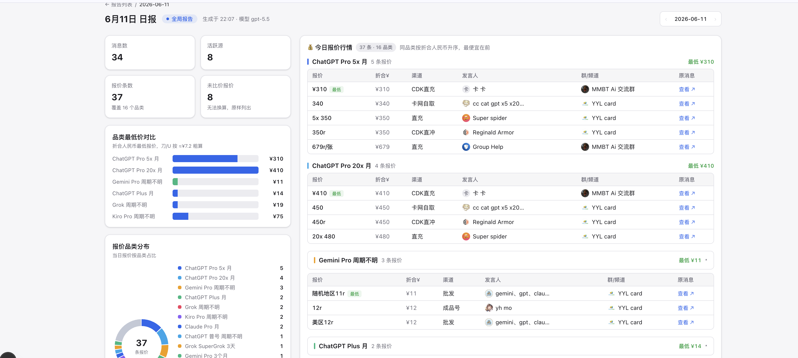
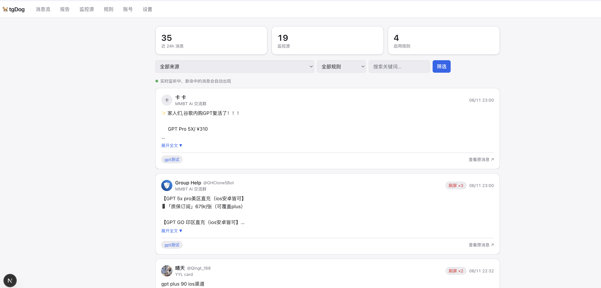
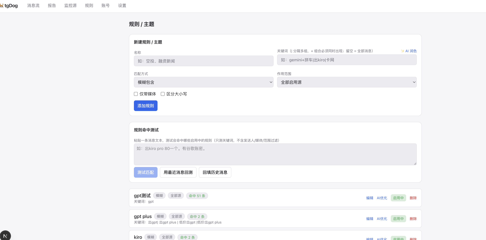
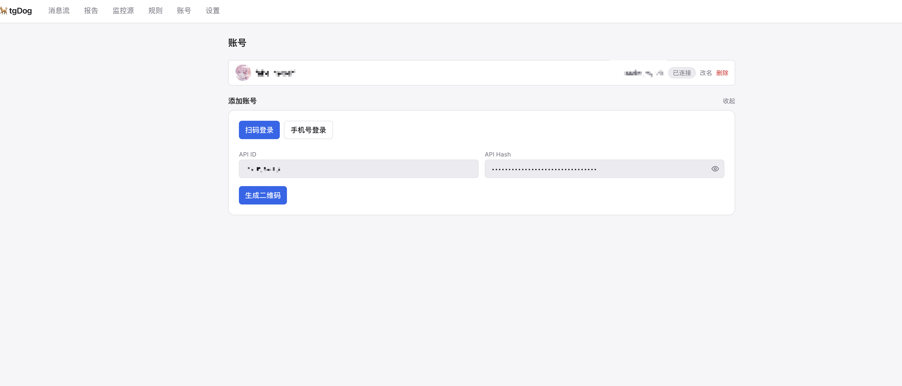
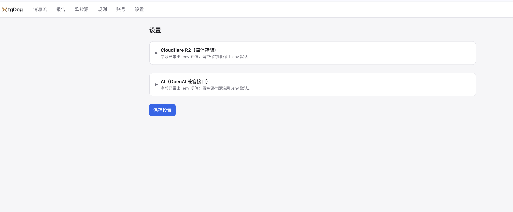

# 🐕 tgDog — Telegram 监控 / 汇总 / 分析

监控你在 Telegram 关注的频道、群组、私聊，按关键词/规则过滤入库，用 AI 生成每日报告，媒体存 Cloudflare R2。

## 界面预览

**每日报告** —— AI 汇总当日消息，自动提取报价并归一化品类比价：



<table>
  <tr>
    <td width="50%" valign="top">
      
      <p align="center"><sub>📡 实时消息流 · 命中规则实时入库，刷屏自动聚合去重</sub></p>
    </td>
    <td width="50%" valign="top">
      
      <p align="center"><sub>🎯 规则配置 · 关键词 / 正则 / 发送人过滤</sub></p>
    </td>
  </tr>
  <tr>
    <td width="50%" valign="top">
      
      <p align="center"><sub>👤 账号管理 · 扫码 / 手机号登录</sub></p>
    </td>
    <td width="50%" valign="top">
      
      <p align="center"><sub>⚙️ 系统设置 · R2 与 AI 配置</sub></p>
    </td>
  </tr>
</table>

## 架构

```
apps/collector   常驻 Node + GramJS worker：登录、监听新消息、规则过滤、媒体→R2、入库
apps/web         Next.js 16 全栈：dashboard、报告、监控源/规则/账号/设置配置
packages/db      Prisma 7 schema + client（Postgres）
packages/core    加密、R2 上传、规则匹配（collector 与 web 共享）
```

- **Collector** 必须常驻（持有 MTProto 长连接），部署在 Railway / Fly.io / VPS。
- **Web** 部署在 Vercel，通过 `INTERNAL_API_SECRET` 调用 collector 的内置登录服务。
- 二者共享同一个 Postgres。

## 准备

1. **Telegram API**：到 https://my.telegram.org 获取 `api_id` / `api_hash`
2. **Postgres**：Supabase 或 Neon 建库，拿到 `DATABASE_URL`
3. **Cloudflare R2**：建 bucket，拿 account id / access key / secret / public URL
4. **AI**：任意 OpenAI 兼容接口的 base URL + key + model

## 本地启动

### 方式 A：Docker 起基础设施 + 本地跑应用（推荐开发用）

只把 Postgres 和 MinIO（本地 R2 替代）放 Docker，应用在 host 上跑，热重载最快：

```bash
pnpm install
cp .env.docker .env          # 已预填本地 Postgres + MinIO，补 Telegram api_id/api_hash 与 AI key
pnpm docker:infra            # 起 postgres + minio + 自动建 bucket
pnpm db:generate && pnpm db:migrate

pnpm dev:collector           # 终端 1
pnpm dev:web                 # 终端 2 → http://localhost:3000
```

- MinIO 控制台：http://localhost:9001 （minioadmin / minioadmin）
- 媒体公开访问：http://localhost:9000/tgdog-media/...

### 方式 B：全部容器化（VPS 部署用这个）

一条命令拉起全部服务（postgres + 自动迁移 + collector + web，媒体存 Cloudflare R2）：

```bash
cp .env.example .env         # 填 DATABASE_URL 以外的配置：Telegram / R2 / AI（默认登录密码 asdf1234）
pnpm docker:up               # 等价于 docker compose up -d --build，建表自动完成
pnpm docker:logs             # 看日志
pnpm docker:down             # 停
```

部署完访问 `http://<服务器IP>:3000`。postgres 端口只绑 127.0.0.1，不暴露公网。
不用 Cloudflare R2 想本地存媒体时，加 MinIO：`docker compose --profile minio up -d --build`（此时 `.env` 里 `R2_ENDPOINT=http://minio:9000`）。

### 方式 C：纯本地（自带 Postgres / 用 Supabase/Neon）

```bash
pnpm install
cp .env.example .env         # 填入 DATABASE_URL / R2 / AI
pnpm db:generate && pnpm db:migrate
pnpm dev:collector           # 终端 1
pnpm dev:web                 # 终端 2
```

## 使用流程

1. 打开 web，用 `APP_PASSWORD` 登录
2. **账号** 页：填 api_id/api_hash，扫码或手机号登录 Telegram
3. **监控源** 页：拉取对话列表，勾选要监控的频道/群
4. **规则** 页：配置关键词（模糊/精确/正则）、发送人过滤、是否仅媒体
5. **消息流**：命中的消息实时入库展示，图片走 R2
6. **设置** 页：配置 R2 与 AI（也可用 env）
7. **报告** 页：点「生成今日报告」，AI 汇总当天消息

## 部署

- **Web → Vercel**：`vercel-build` 跑 `prisma generate && prisma migrate deploy && next build`；设 env（含 `COLLECTOR_LOGIN_URL` 指向 collector 公网地址、`INTERNAL_API_SECRET`）
- **Collector → Railway/Fly.io**：`pnpm --filter @tgdog/collector start`，常驻；同一 `DATABASE_URL` 与 `INTERNAL_API_SECRET`，暴露 `COLLECTOR_LOGIN_PORT`

## 安全

- session、api_hash、R2/AI 密钥均用 `ENCRYPTION_KEY`（AES-256-GCM）加密落库
- web 单用户密码 + 签名 cookie；collector 登录服务用共享 secret 鉴权
